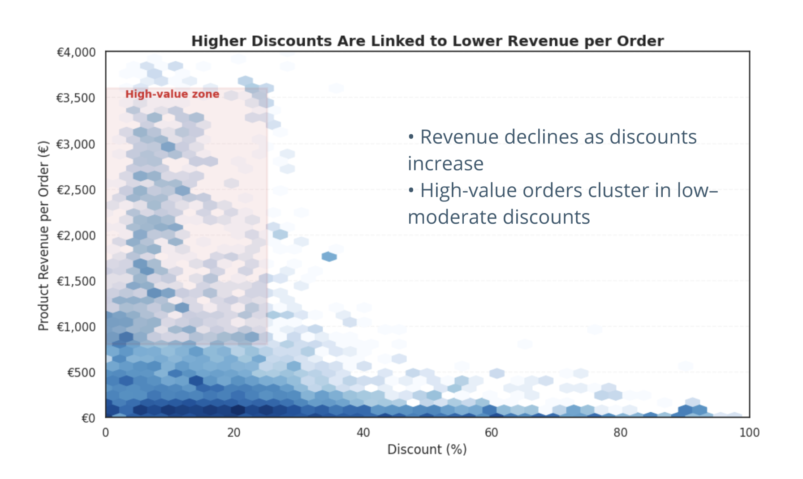
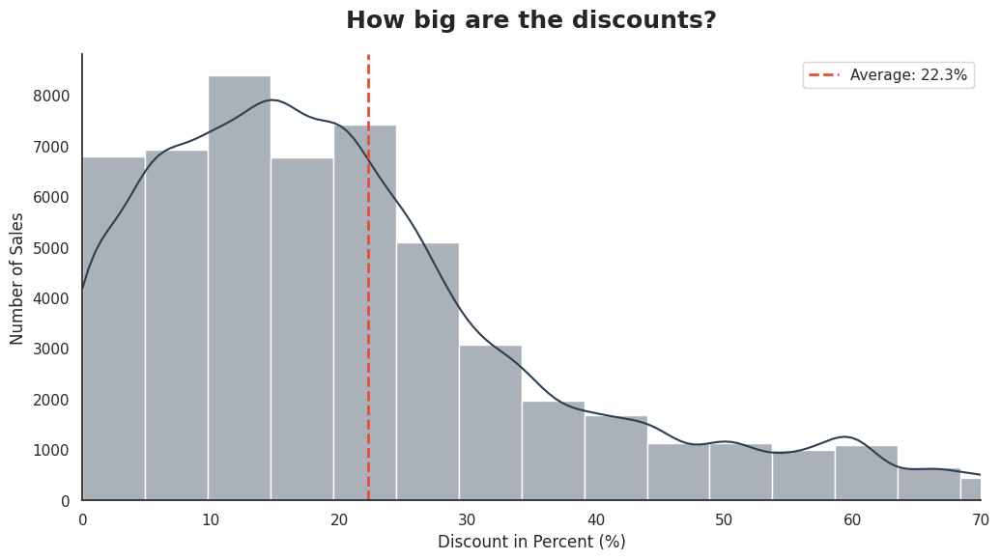
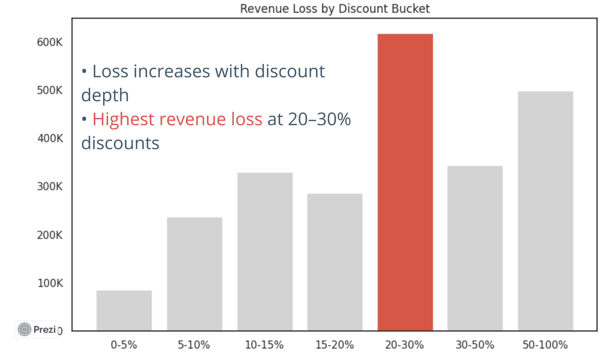
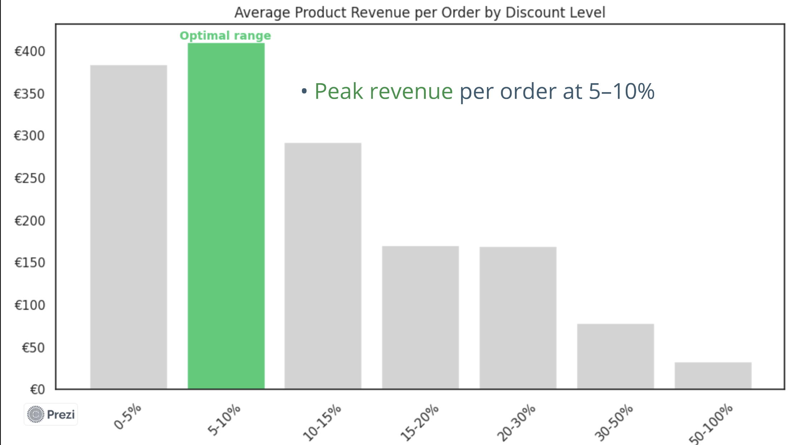
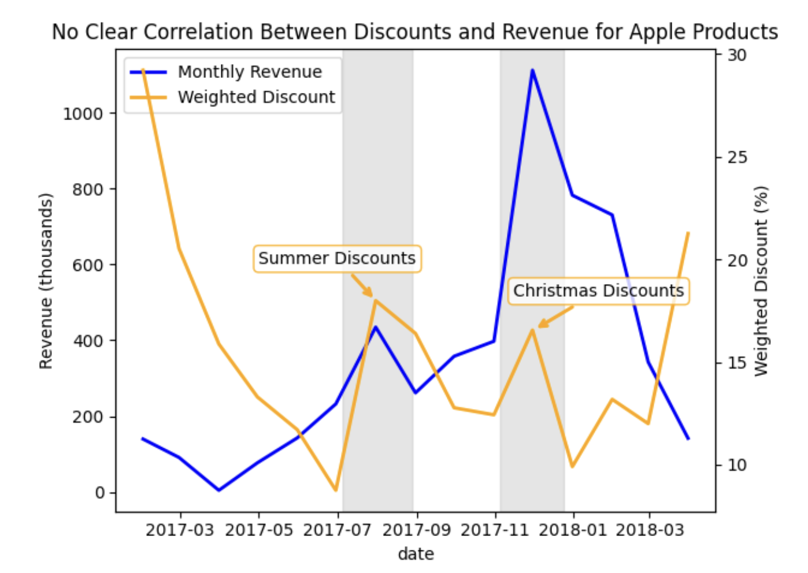

# Optimizing Discount Strategy: A Data-Driven Revenue Analysis

# 📌 Project Overview

This project analyzes the impact of discounting on revenue performance using transactional data from a bootcamp case study.

The objective was to evaluate whether discounts create value or lead to revenue loss, and whether discounting is applied strategically or broadly across the portfolio.

This work was developed as part of a **team project**, where I focused on analyzing discount impact, revenue efficiency, and strategic pricing implications.

---

### 🎯 Business Objective

The analysis aimed to answer two core questions:

* Does discounting increase revenue or lead to revenue loss?
* Are discounts applied strategically, or are they used too broadly?

---

### 🔍 Key Findings

* Discounts are heavily overused across the portfolio
* Higher discounts lead to significant revenue loss
* Customer demand does not increase with higher discounts
* The optimal discount range is **5–10%**
* The current average discount (~22%) is significantly above optimal
* Discounts are applied broadly rather than strategically

---

### 📊 Key Visual Insights

### Discount vs Revenue



### Average Discount Level



### Revenue Loss by Discount Bucket



### Optimal Discount Level



### Correlation between Revenue and Discounts



---

### 💡 Conclusion

The current discount strategy reduces revenue efficiency and does not generate proportional value.

A more targeted approach is required:

* Focus on low discount levels (5–10%)
* Apply discounts selectively rather than across the entire portfolio
* Use discounts strategically for **seasonal high-volume periods** (e.g., Black Friday)  
* Apply discounts for **stock clearance**, rather than on best-selling products

 ---
 
 ### ⚠️ Data Quality & Future Improvements

* Incorporate profit / margin data for deeper insights
* Improve data consistency and tracking of discount application
* Implement **A/B testing** to evaluate the true impact of different discount levels
* Enhance data collection processes to ensure cleaner and more reliable datasets

---

## 📁 Project Structure

```text
discount-strategy-analysis/
├── data/            # dataset or sample data
├── images/          # visualizations used in the project
├── notebooks/       # analysis notebooks
├── README.md        # project documentation
├── requirements.txt # dependencies
```

---

## 📗 Notebooks

[](https://colab.research.google.com/drive/1mh0ge5iwumaA_BpDdo9OcEskO26PzQdw)

[](https://colab.research.google.com/drive/1SVtSF9SM7h2zd_JmA5qMnz6I92HH7wYC)

---

## 🛠️ Tools & Technologies

* Python
* Pandas
* Matplotlib
* Seaborn
* Jupyter Notebook / Google Colab

---


## 📊 Project Contribution

This project was developed as a collaborative team effort, combining different analytical perspectives to evaluate business performance.

My primary contribution focused on the visualizations and analyses presented in this section, including:

* Exploration of discount distribution
* Analysis of revenue impact across discount levels
* Identification of patterns between pricing and performance
* Development of data visualizations to support business insights

---

## 📎 Presentation

👉 https://prezi.com/view/vvTvKs9qmEhNW8DYYX1e/?referral_token=Ki3dK4lnB3FN


